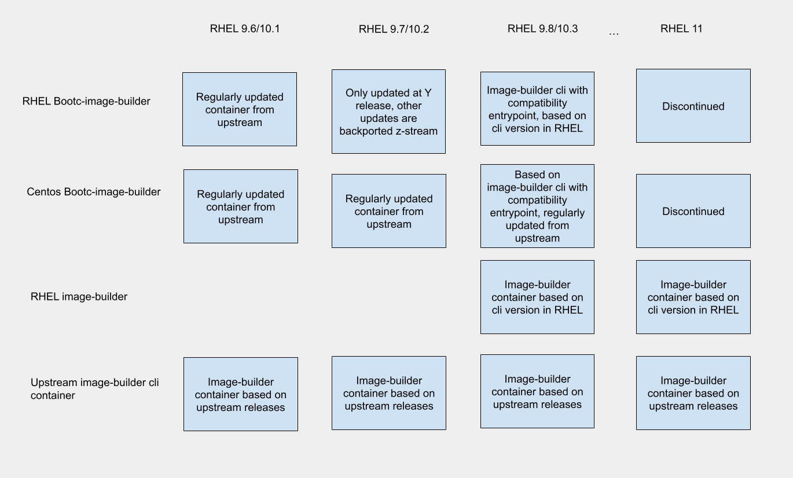

# Deprecation notice: bootc-image-builder

The osbuild project is **converging package mode and image mode** into a single, unified image-building experience. As part of that effort, the standalone **bootc-image-builder** container and CLI are being deprecated in favor of the unified **image-builder** CLI.

This document describes the timeline, migration path, and what you need to do.

## Why we're deprecating bootc-image-builder

We are unifying the tooling so that one CLI can build images from **blueprints** (package mode) and convert **bootable containers** (image mode). The unified [image-builder](https://www.osbuild.org/docs/developer-guide/projects/image-builder/) project already supports [building from bootc container inputs](https://osbuild.org/docs/developer-guide/projects/image-builder/usage/#bootc) via `--bootc-ref` and related options, with functional equivalence to what bootc-image-builder provides. Maintaining two separate codebases and containers is no longer necessary; consolidating reduces maintenance and gives users a single entry point for all image-building workflows.

## Timeline and process

### RHEL 9/10 (and current container)

- **Backward compatibility is guaranteed for the full life of RHEL 10.** Existing automation, documentation, and pipelines that run the **bootc-image-builder** container remain supported.
- **Starting in RHEL 9.8/10.2**, bootc-image-builder will start only shipping new major versions with each RHEL Y release.  Upstream releases will no longer be backported to the RHEL 10.Y image. 
- **Starting in RHEL 9.9/10.3**, the RHEL bootc-image-builder container will be built on the **image-builder** container (the unified implementation). It will **not** ship the original standalone bootc-image-builder binary. Instead, the container exposes a **bootc-image-builder entry point** that wraps the image-builder cli so that existing `podman run … bootc-image-builder` style invocations keep working without changing flags or workflows.  A new container **image-builder** will be shipped that contains the same binary as bootc-image-builder, but without the compatibility entry point.  Both the **bootc-image-builder** and **image-builder** containers will ship with the same version of image-builder cli that is available as an rpm in respective RHEL release. 

### RHEL 11

- **Only the image-builder container and package will be shipped.** The **bootc-image-builder** container and executable will no longer be provided.
- Consumers must complete migration to the image-builder package or container before relying on RHEL 11 or building RHEL 11.

## What you should do

1. **Prefer the image-builder package or container for new work.** Use the [image-builder](https://www.osbuild.org/docs/developer-guide/projects/image-builder/) documentation and invoke **image-builder**. From RHEL 10.3 onward, the RHEL container is image-builder cli based; the bootc-image-builder entry point exists only for backward compatibility.
2. **If you use the Podman plugin or other tooling** that invokes bootc-image-builder, plan for a reverse-dependency check and testing with the new image-builder CLI before the RHEL 11 cutover.
3. **If you rely on the Anaconda ISO image type:** The unified CLI currently supports the Anaconda ISO type, but we plan to **deprecate it, and remove it in RHEL 11** and move to fully container-based installer ISOs (e.g., bootc-installer) in line with Image Mode strategy. Prefer container-based installer flows where possible.

## Repository and archive

Development is moving to the unified [image-builder](https://github.com/osbuild/image-builder-cli) repository. The [bootc-image-builder](https://github.com/osbuild/bootc-image-builder) repository will be **archived** after the migration plan is complete; issues and relevant contributions will be handled in the unified project. We will publish this migration plan on osbuild.org and link to it from repository notices so that existing users and contributors have a single place to reference.

## Summary

## Questions and feedback

- **Documentation:** [osbuild.org docs](https://www.osbuild.org/docs/bootc/)
- **Discussions:** [GitHub Discussions](https://github.com/orgs/osbuild/discussions)
- **Matrix:** [#image-builder on fedoraproject.org](https://matrix.to/#/#image-builder:fedoraproject.org)

If you have concerns or need help planning your migration, please reach out through one of the channels above.
